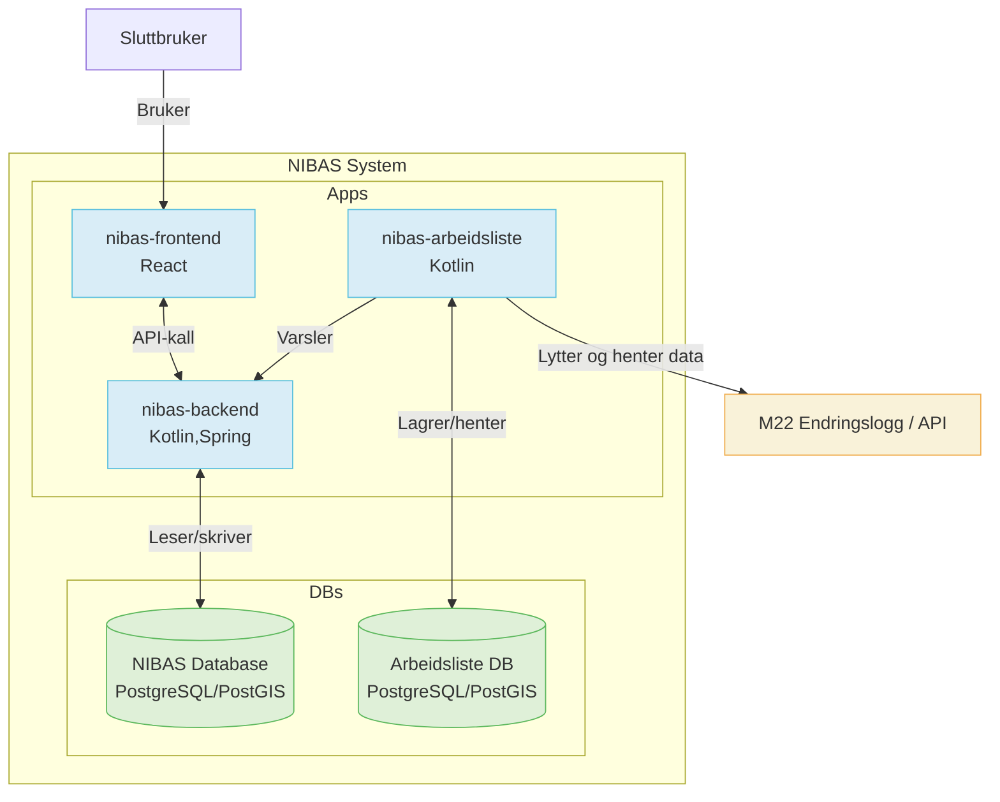

# Arkitektur

## Komponenter

* **Nibas-arbeidsliste**
    * Henter grenser fra M22 og lager i nibas-arbeidslist database. Fra endringslogg
    * Finner avvik mellom M22 og NIBAS og lager i nibas-arbeidslist database
    * Sender avvik til nibas-fronted via proxy i nibas-backend

* **nibas-backend**
    * Proxy for nibas-arbeidsliste
    * Autentisering/autorisasjon
    * Dataformatering
    * har tilgang til nibas-db, som har all info om grense til nibas systemt

* **nibas-frontend**
    * Viser avvik til sluttbruker
    * Interaktivt grensesnitt
    * Sender fikset grense til nibas-backend, som oppdaterer grense i nibas-db

* **M22-endringlogg**
    * Nibas-arbeidlis lytter på endringslogg til M22
    * Oppdater M22 grenser i nibas-arbeidsliste database ved behov.

## Dataflyt
1. Nibas-arbeidsliste henter og prosesserer data fra M22
2. Avvik sendes til nibas-backend
3. Frontend henter og viser data via backend
