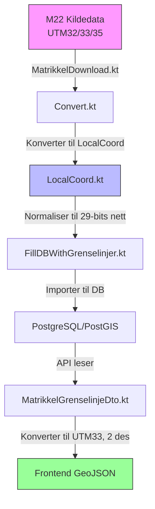

# Koordinathåndtering i NIBAS Arbeidsliste

Dette dokumentet forklarer koordinattransformasjonspipeline som brukes i NIBAS Arbeidsliste-systemet.

## Koordinatreferansesystemer (KRS)

- **UTM Sone 33N (EPSG:25833)** - Internt arbeids-KRS
- UTM Sone 32N/35N (EPSG:25832/25835) - Konverteres til UTM33 ved import
- WGS84 (EPSG:4326) - Brukes for visning i frontend

## Dataflyt

### 1. Kildedata
- M22 databasefiler (`.fb`-format)
- Opprinnelig KRS: Hvilken som helst UTM-sone (32/33/35)
- Format: FlatBuffers binært

### 2. Konverteringsprosess (`RunConvert.kt`)
1. Skanner etter `grenselinje` og `grensepunkt`-filer
2. Behandler gjennom konverteringspipeline
3. Eksporterer filer med `matrikkel_`-prefiks

### 3. Koordinattransformasjon (`Convert.kt` med `LocalCoord.kt`)

#### Hovedkomponenter:
- `LocalCoord`-klassen: Normaliserer koordinater
  - 29-bits heltallsnett (0 til 536.870.911)
  - Sentrert på UTM33 (x=500.000, y=7.714.626)
  - ~5mm presisjon

#### Transformasjonstrinn:
1. **Inndata**: UTM32/33/35-koordinater
2. **Normaliser**:
   - Konverter til UTM33 hvis nødvendig
   - Skaler til intern representasjon
3. **Utdata**: Tilbake til UTM33 for lagring

### 4. Databaseimport (`FillDBWithGrenselinjer.kt`)
- Importerer til PostgreSQL/PostGIS
- Bruker `ST_GeomFromText(?, 25833)`
- Lagrer som `geometry(LineString, 25833)`
- Håndterer duplikater med `ON CONFLICT (id) DO NOTHING`

## Lokalt koordinatsystem (LocalCoord)

### Konstanter
- `UTM33_EXTENT`: 2.684.354,56m (~2.684km)
- `UTM33_CENTER_X`: 500.000,0 (østlig verdi)
- `UTM33_CENTER_Y`: 7.714.626,0 (nordlig verdi)
- `EXTENT`: 536.870.912 (2^29)
- `UTM33_RESOLUTION`: ~0,005m (5mm)

### Konverteringsformler

#### Til LocalCoord:
```kotlin
localX = (utmX - UTM33_X_MIN_INCLUSIVE) / UTM33_RESOLUTION
localY = EXTENT - ((utmY - UTM33_Y_MIN_EXCLUSIVE) / UTM33_RESOLUTION)
```

#### Fra LocalCoord:
```kotlin
utmX = UTM33_X_MIN_INCLUSIVE + (localX * UTM33_RESOLUTION)
utmY = UTM33_Y_MIN_EXCLUSIVE + ((EXTENT - localY) * UTM33_RESOLUTION)
```

### Presisjon
- Lagres som Long i databasen (29-bits heltallsnett)
- Konverteres til/fra UTM33 med 2 desimaler i API-et
- Gir ~5mm presisjon innenfor UTM33-grensene

## Koordinatreise



## API & Frontend
- API returnerer GeoJSON i UTM33
- Alle målinger i UTM33 for nøyaktighet

## Feilsøking

### Vanlige problemer
1. **Feil plassering**
   - Sjekk at KRS er satt til EPSG:25833

2. **Presisjonsproblemer**
   - Kontroller avrunding i DTO-er

3. **Treg ytelse**
   - Bruk batchbehandling for store datasett